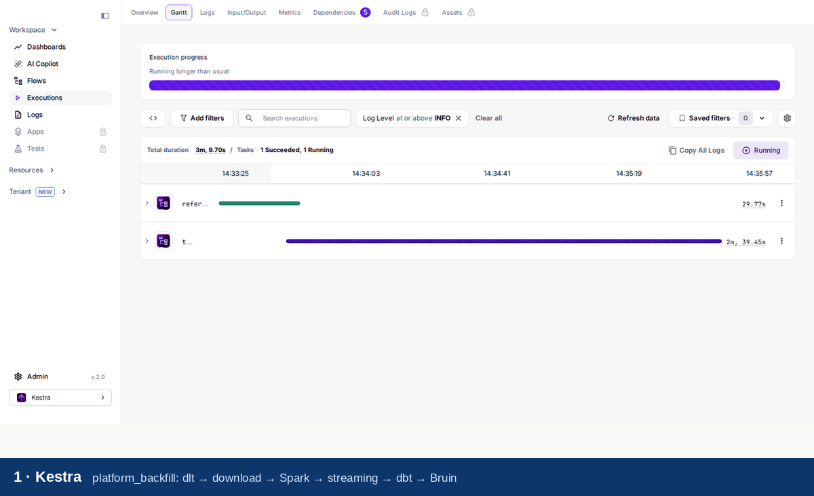
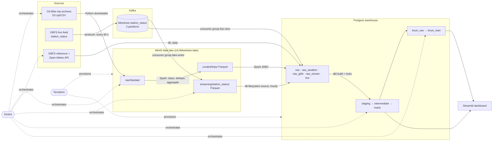
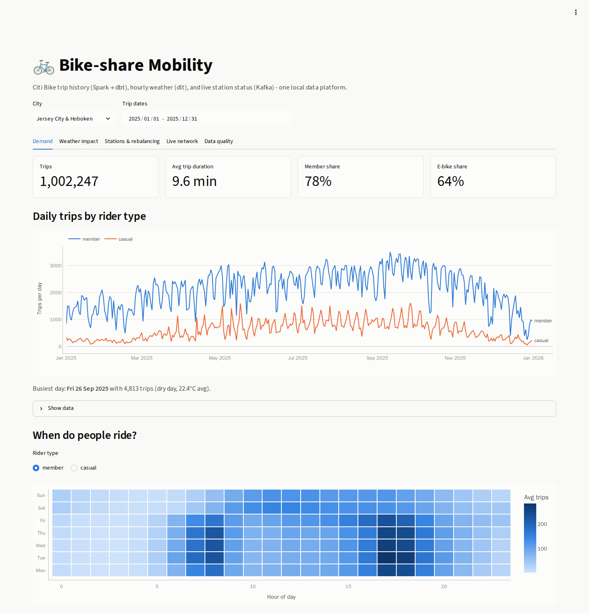
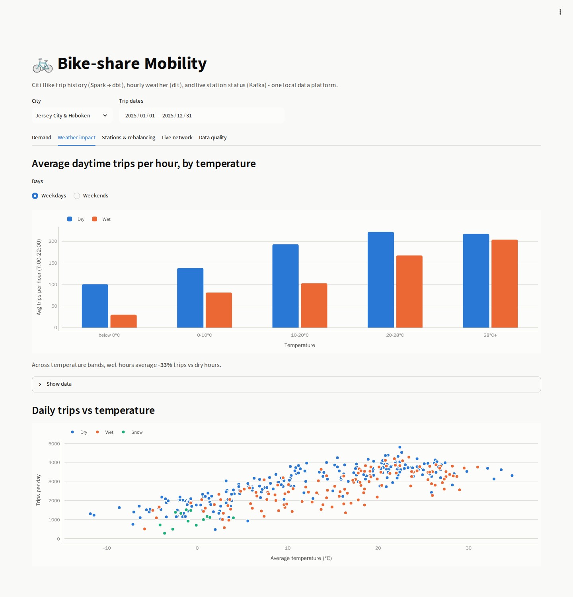
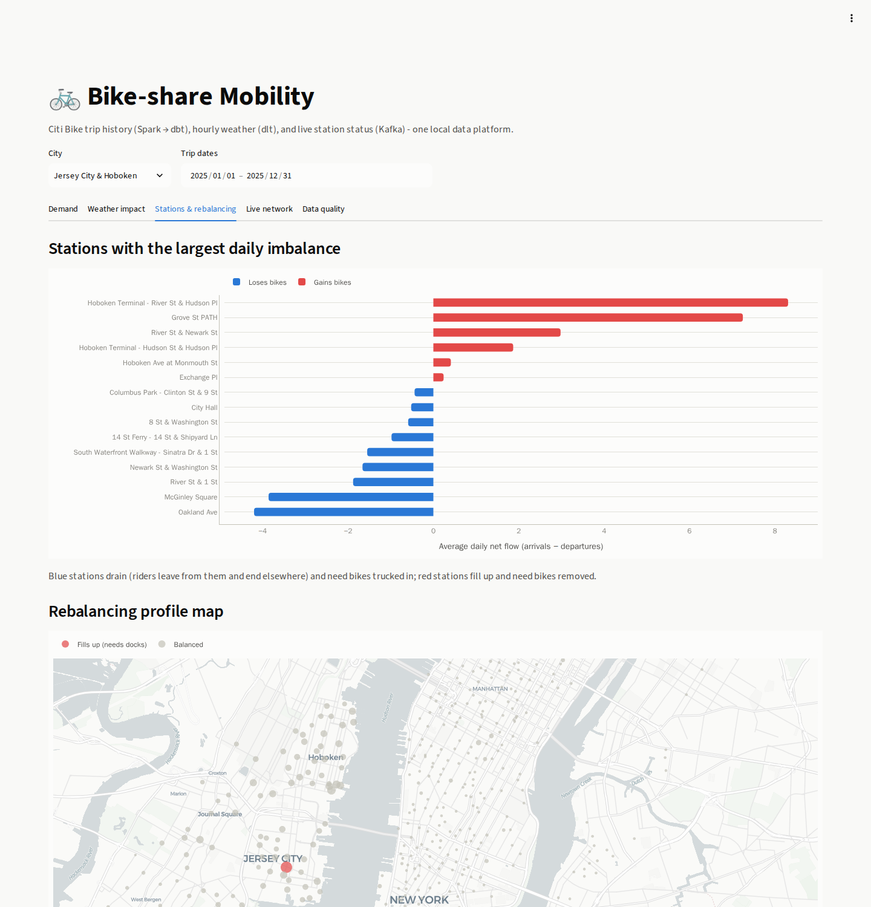
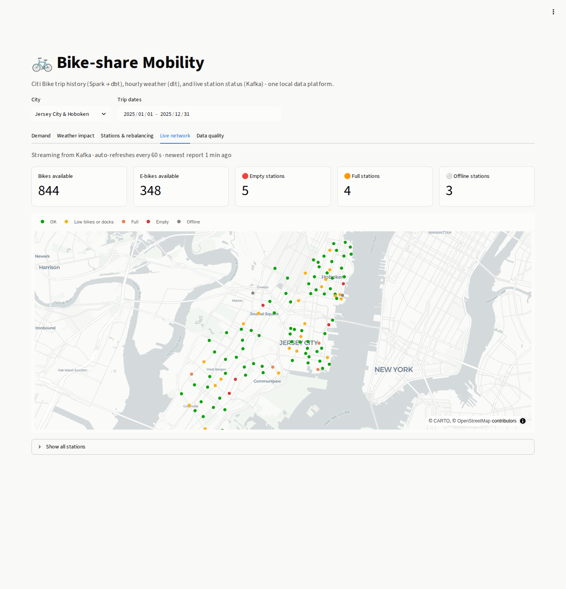
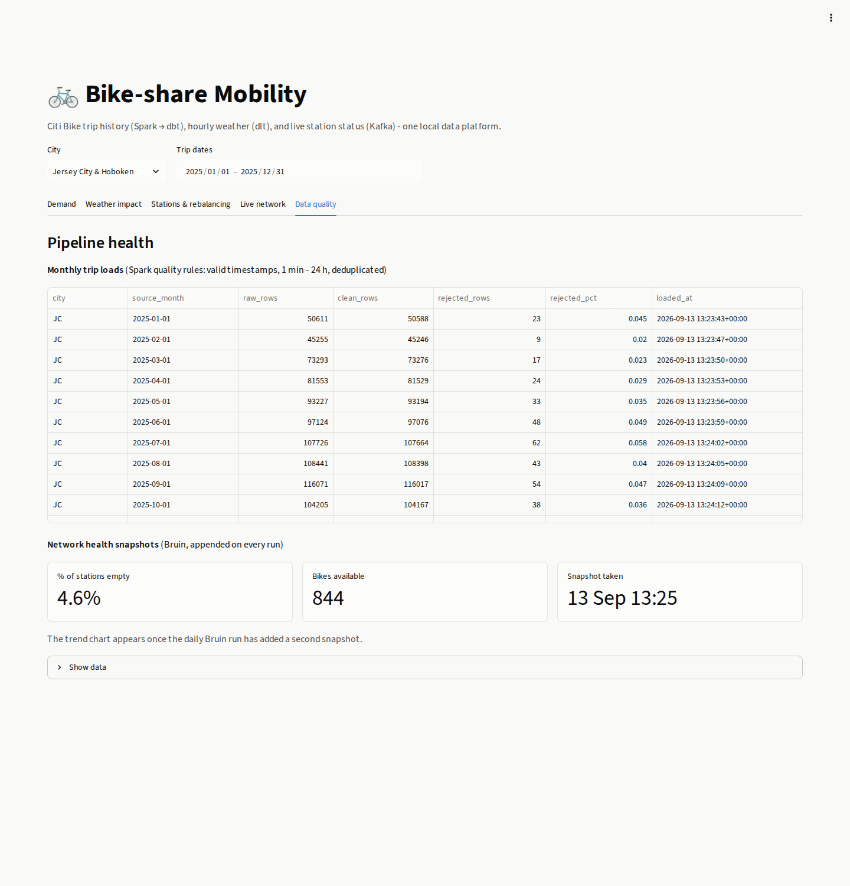

# 🚲 Bike-share Mobility Data Platform

An end-to-end data engineering project on **Citi Bike** (New York City and Jersey City) data.
It combines **batch** trip history, **streaming** live station status and **API** weather data.
Everything runs locally on Docker, with no cloud account needed.



**Tested at scale:** one month of New York City data (June 2025, **4.76M trips**) runs end to end in **under 9 minutes** on a laptop:
download, Spark, streaming micro-batch, the full dbt build with tests, and Bruin.

### Tech stack

| Layer | Tool | Where in this repo |
|---|---|---|
| Containers & infrastructure as code | Docker Compose, **Terraform** | `docker-compose.yml`, `infra/terraform/` |
| Workflow orchestration | **Kestra** 2.0 | `kestra/flows/` |
| API & file ingestion | **dlt** | `src/bikeshare/ingestion/dlt_*.py` |
| Data lake | **MinIO** (S3 API) | bucket `bikeshare-lake` |
| Batch processing | **Spark** 4 | `src/bikeshare/spark/` |
| Streaming | **Kafka** 4 | `src/bikeshare/streaming/` |
| Data warehouse | **Postgres** 17 (partitioned & indexed) | `src/bikeshare/warehouse/bootstrap.sql` |
| Transformations & tests | **dbt** | `dbt/` |
| Data platform / quality checks | **Bruin** | `bruin/` |
| Dashboard | **Streamlit** + Plotly | `dashboard/app.py` |

---

## 1. Problem

Bike-share operators have three daily problems:

1. **Demand planning.** How many trips should they expect, from whom (members vs. casual riders), and when?
2. **Weather sensitivity.** How much do rain and temperature change demand?
3. **Rebalancing.** Some stations drain while others fill up, so staff must truck bikes around.
   Which stations drain, which fill, and what does the network look like *right now*?

This platform answers those questions. It joins **multi-million-row trip history** with **hourly weather**,
computes **station-level net flows**, and streams **live station availability** every minute.

### Data sources (all free, no API keys)

| Source | Type | Volume | Used for |
|---|---|---|---|
| [Citi Bike trip data](https://s3.amazonaws.com/tripdata/index.html) | Monthly zipped CSV | JC ≈ 100k trips/month · NYC ≈ 4-5M trips/month | Batch (Spark) |
| [Citi Bike GBFS feed](https://gbfs.citibikenyc.com/gbfs/2.3/gbfs.json) `station_status` | JSON, refreshed every 60 s | ~2,500 stations | Streaming (Kafka) |
| GBFS `station_information`, `system_regions`, `system_pricing_plans` | JSON | reference data | dlt, Bruin |
| [Open-Meteo](https://open-meteo.com/) archive + forecast API | JSON | hourly, per city | dlt (incremental) |

---

## 2. Architecture



### Data flow in detail

**Batch** (`trips_batch` flow, monthly):
1. `trips_to_lake.py` finds the month's archive in the Citi Bike bucket and downloads it.
   It streams every CSV inside (including nested zips) to `raw/tripdata/city=/month=`,
   then writes a `_SUCCESS` marker so re-runs skip finished months.
2. The Spark job `process_trips.py` does the heavy lifting:
   - enforces a schema and parses timestamps safely (`try_to_timestamp`)
   - drops invalid trips: bad timestamps, trips shorter than 1 minute or longer than 24 hours, wrong month, unknown rider type
   - deduplicates on `ride_id`
   - derives duration, haversine distance and a round-trip flag
   - writes curated Parquet with the S3A **magic committer** (rename-free commits on object storage)
   - aggregates daily departures, arrivals and net flow per station
   - loads both into Postgres over JDBC, idempotently per (city, month)
   - records row counts in `raw.trip_load_audit`

**Streaming** (always on):
- `producer.py` polls GBFS every 60 s and publishes only stations whose `last_reported` changed.
  Messages are keyed by `station_id`, so each station's events stay ordered within a partition.
  The producer is idempotent (`acks=all`, zstd compression).
- `consumer_lake.py` (group `lake-writer`) buffers messages and writes zstd Parquet files partitioned by `dt=/hour=`.
  It commits offsets **after** each file is written, giving at-least-once delivery; dbt removes duplicates later.
- `consumer_live.py` (group `live-view`) upserts the latest status per station into `live.station_status_latest`.
  A `last_reported` guard ensures older events never overwrite newer ones.
- Each hour the `stream_lake_to_warehouse` flow loads new lake files with dlt, using an incremental cursor on file modification time.

**Reference data** (`reference_data_daily` flow):
- dlt loads GBFS stations and regions with `merge` on their natural keys.
- dlt loads Open-Meteo weather incrementally: state is kept per city, the last 3 days are re-fetched to pick up corrected values,
  and rows are merged on `(city, observed_at)`.

---

## 3. Warehouse design

Postgres plays the role a cloud warehouse such as BigQuery would. The usual cloud-warehouse optimisations translate as follows:

| BigQuery concept | Implementation here | Why |
|---|---|---|
| Dataset | Schema per layer (`raw`, `staging`, `intermediate`, `marts`, …), created by **Terraform** | Clear layer separation and permissioning |
| Partitioned table | `raw.trips` is **range-partitioned by `started_at`**, one partition per month (`raw.trips_2025_06`, …) | Month filters prune partitions, and a month reload only touches one partition |
| Clustering | B-tree indexes on `(city, source_month)` and `start_station_id`; a **BRIN** index on `started_at` | Station and time-range queries skip most blocks; BRIN is tiny on time-ordered data |
| IAM | Read-only `dashboard_reader` role with `USAGE`/`SELECT` on `marts`, `live` and `bruin_mart` only, plus **default privileges** for future tables | Least privilege for the serving layer |
| Incremental loads | `fct_trips` is incremental per (city, month), driven by the Spark load audit | Avoids a row-by-row merge over millions of trips |

---

## 4. Transformations: dbt

```
sources (raw, raw_weather, raw_gbfs, raw_stream, live)
  └─ staging (views)      stg_trips, stg_weather_hourly (+ WMO seed), stg_gbfs_stations,
                          stg_station_daily_flows, stg_station_status (dedup), stg_trip_load_audit
      └─ intermediate     int_trips_enriched (trip ⨝ weather at start hour)
          └─ marts        fct_trips (incremental), dim_stations, dim_date,
                          agg_daily_demand, mart_daily_city_summary, mart_weather_impact,
                          mart_hourly_demand_profile, mart_station_rebalancing,
                          mart_station_availability_hourly, mart_live_station_status (view),
                          mart_pipeline_load_audit
```

- **30+ data tests:** `unique`, `not_null`, `accepted_values`, `relationships`, a custom generic
  `unique_combination_of_columns`, and singular tests. One singular test checks that
  **`fct_trips` row counts exactly reconcile with Spark's load audit**.
- **Source freshness** is configured for the weather feed, the load audit and the live table.
- An **exposure** documents the dashboard's dependencies.
- Docs: `.\make.ps1 dbt-docs` serves them at http://localhost:8082.

## 5. Data platform: Bruin

`bruin/` is a separate pipeline showing Bruin's all-in-one approach:
- a **Python asset** (`gbfs_pricing_plans.py`) that ingests pricing plans and is materialized by Bruin
- **`pg.source` assets** declaring lineage to dbt tables
- **SQL assets** with column checks (`not_null`, `unique`, `accepted_values`, `min`/`max`, `positive`) and **custom checks**:
  - `ebike_single_ride_revenue_daily`: estimated casual e-bike revenue from the current GBFS price
  - `network_health_snapshots`: an **append** strategy that builds a history of network health snapshots

## 6. Orchestration: Kestra

| Flow | Schedule | What it does |
|---|---|---|
| `trips_batch` | 20th of each month, 06:00 | download → Spark → dbt (`@source:raw`) |
| `reference_data_daily` | daily 05:00 | dlt stations ∥ dlt weather (parallel) → dbt |
| `stream_lake_to_warehouse` | hourly at :05 | dlt lake files → dbt availability models |
| `dbt_full_build` | manual | seed, build, freshness, docs |
| `bruin_pipeline` | daily 07:00 | Bruin validate + run |
| `platform_backfill` | manual | runs all of the above as subflows, in order |

Every task runs in the `bikeshare-pipelines` image through Kestra's Docker task runner, on the compose network.
Flows use retries, a concurrency limit, input validation and error handlers.

## 7. Dashboard

http://localhost:8501 has five tabs, all filtered by one city/date filter row:

1. **Demand:** KPI tiles, daily trips by rider type, weekday × hour heatmap, estimated e-bike revenue (Bruin)
2. **Weather impact:** trips per hour by temperature band (dry vs. wet), and daily trips vs. temperature
3. **Stations & rebalancing:** top imbalanced stations (diverging bars) and a rebalancing profile map
4. **Live network:** real-time map of empty, full and offline stations, refreshed every 60 s from the Kafka-fed table
5. **Data quality:** Spark load audit (rejected rows per month) and the Bruin network-health history

Every chart has a "Show data" table view. The dashboard connects as the read-only role.

| Demand | Weather impact |
|---|---|
|  |  |
| **Stations & rebalancing** | **Live network (Kafka)** |
|  |  |

<p align="center"></p>

*Screenshots from a full 2025 backfill for Jersey City & Hoboken (1,002,247 trips).*

---

## 8. Run it

### Prerequisites
- Docker Desktop (WSL2 backend on Windows) with **≥ 8 GB RAM** allocated (16 GB recommended for NYC data)
- ~10 GB free disk for JC; add ~6 GB per NYC month
- Nothing else. Terraform, Python, Spark, dbt and Bruin all run in containers.

### Quick start (Windows PowerShell)

```powershell
git clone https://github.com/Nabil-Sehli/bikeshare-data-platform.git
cd bikeshare-data-platform
.\make.ps1 setup                                        # ~10 min the first time (image build)
.\make.ps1 backfill -City JC -Start 2025-01 -End 2025-12
```

### Quick start (Linux / macOS / WSL)

```bash
git clone https://github.com/Nabil-Sehli/bikeshare-data-platform.git && cd bikeshare-data-platform
make setup
make backfill CITY=JC START=2025-01 END=2025-12
```

`setup` runs these steps: build image → start Postgres/MinIO/Kafka → `terraform apply` → create warehouse tables →
start Kestra, streaming services and dashboard → deploy flows.
`backfill` triggers the `platform_backfill` flow in Kestra and waits for it to finish.

For the big dataset, run `backfill -City NYC -Start 2025-06 -End 2025-06`.

Measured runs (Docker Desktop, 16 CPUs, 16 GB RAM assigned):

| Backfill | Raw rows | Clean trips | Rejected | Wall time (whole `platform_backfill`) |
|---|---|---|---|---|
| JC, Jan-Dec 2025 (12 months) | 1,002,704 | 1,002,247 | 0.05% | ~3.5 min |
| NYC, Jun 2025 (1 month, 1 GB zip) | 4,759,345 | 4,757,402 | 0.04% | ~9 min (Spark step ~4 min) |

Each NYC month adds roughly 5 GB to the lake (raw CSV) and 2 GB to Postgres.

### URLs and local credentials (from `.env`)

| Service | URL | Login |
|---|---|---|
| Dashboard | http://localhost:8501 | - |
| Kestra | http://localhost:8080 | `admin@bikeshare.local` / `Bikeshare123!` |
| MinIO console | http://localhost:9001 | `minioadmin` / `minioadmin_local_pw` |
| Kafka UI | http://localhost:8081 | - |
| Postgres | `localhost:5433`, db `bikeshare` | `bikeshare` / `bikeshare_local_pw` |
| dbt docs | http://localhost:8082 (`make.ps1 dbt-docs`) | - |

### Other tasks

```powershell
.\make.ps1 status        # container health
.\make.ps1 logs          # follow producer / consumers
.\make.ps1 dbt-build     # run dbt directly
.\make.ps1 bruin         # run Bruin directly
.\make.ps1 test          # ruff + pytest (incl. Spark) + dbt parse + terraform validate
.\make.ps1 down          # stop (data kept)
.\make.ps1 destroy       # stop and delete all volumes
```

---

## 9. Project structure

```
bikeshare-data-platform/
├── docker-compose.yml            # whole platform
├── docker/pipelines/             # one image: Spark + dlt + Kafka clients + dbt + Bruin + Streamlit
├── infra/terraform/              # MinIO bucket + lifecycle, Postgres schemas, roles, grants
├── kestra/flows/                 # 6 flows (deployed via API by `deploy-flows`)
├── src/bikeshare/
│   ├── ingestion/                # trips_to_lake, dlt_weather, dlt_stations, dlt_lake_status
│   ├── spark/                    # SparkSession (S3A + magic committer), process_trips
│   ├── streaming/                # producer, consumer_lake, consumer_live
│   ├── warehouse/                # bootstrap.sql (partitioned tables, indexes)
│   └── tools/kestra.py           # deploy / run flows through the Kestra API
├── dbt/                          # models, seeds, tests, macros, exposure
├── bruin/                        # Bruin pipeline (Python + SQL assets with checks)
├── dashboard/app.py              # Streamlit dashboard
├── tests/                        # pytest, including Spark transformation tests
├── .github/workflows/ci.yml      # lint, tests, dbt parse, terraform validate, image build
├── make.ps1 / Makefile           # task runners
└── .env.example                  # all configuration
```

## 10. Reproducibility and quality

- **One command to provision, one command to run.** All tooling is containerised and dependencies are locked (`requirements.lock` via `uv`).
- **Idempotent everywhere.** Lake months use `_SUCCESS` markers; Spark deletes and reloads per (city, month); dlt uses merge and incremental state;
  `fct_trips` deletes and reloads months the audit marks as reloaded; the live upsert never regresses to older data.
- **Tests at every layer.** Spark unit tests, dbt data tests with reconciliation against the load audit, Bruin quality checks, and CI.

## 11. Moving to GCP later

The local services map one-to-one onto managed cloud equivalents (GCP shown):
- MinIO → **GCS**: swap `S3_ENDPOINT` for `gs://` and use the GCS connector instead of S3A
- Postgres → **BigQuery**: `dbt-bigquery`, the dlt `bigquery` destination, and `partition_by` / `cluster_by` configs
- Terraform: swap the `minio`/`postgresql` providers for `google_storage_bucket` / `google_bigquery_dataset`
- Kafka → Confluent Cloud or Pub/Sub; Spark → Dataproc

## 12. Data sources & attribution

The code is released under the [MIT License](LICENSE). The repository contains **code only**: no data is committed, and every dataset is downloaded at run time from its source under its own terms.

- Trip history and GBFS feeds: [Citi Bike System Data](https://citibikenyc.com/system-data), provided by Lyft Bikes and Scooters, LLC under the [Citi Bike Data License Agreement](https://citibikenyc.com/data-sharing-policy).
- Weather: [Open-Meteo.com](https://open-meteo.com/), licensed under [CC BY 4.0](https://creativecommons.org/licenses/by/4.0/).
- Map tiles: © [CARTO](https://carto.com/attributions), © [OpenStreetMap](https://www.openstreetmap.org/copyright) contributors.

The credentials in `.env.example` are placeholders for a local, single-machine stack. Change them before exposing any service beyond `localhost`.

## 13. Troubleshooting

| Symptom | Fix |
|---|---|
| `make.ps1` is blocked by execution policy | `powershell -ExecutionPolicy Bypass -File .\make.ps1 setup` |
| Kestra tasks fail with "image not found" | `.\make.ps1 build` (tasks use the local `bikeshare-pipelines:latest` image) |
| Spark runs out of memory on NYC months | Raise Docker Desktop memory and `SPARK_DRIVER_MEMORY` in `.env` |
| Dashboard live tab is empty | `.\make.ps1 logs`; the producer needs internet access to reach `gbfs.lyft.com` |
| Port already in use | Change the host ports in `docker-compose.yml` (for example `PG_HOST_PORT` in `.env`) |
